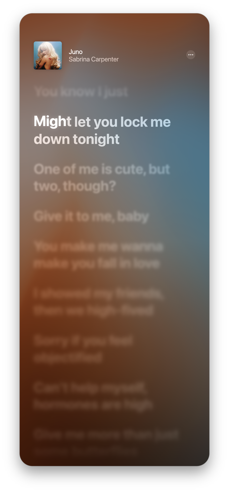

<div align="left">

# 🌸 LyricsBlossom

**macOS** · **Windows**

[](https://github.com/Eplorr/LyricsBlossom/releases/latest)
[](#-license)

## Features

**迄今为止最完美的 Apple Music 还原** 

逐词歌词、动态背景、动态封面，应有尽有

**完美的体验** — 完美支持 Apple Music 歌词，1:1 级别完美还原

**GPU 加速** — 基于 Skia，macOS 支持 Metal / OpenGL，Windows 支持 Vulkan / OpenGL

---

## Download / 下载

前往 **[Releases](https://github.com/Eplorr/LyricsBlossom/releases/latest)** 下载最新版本。

---

## System Requirements / 系统要求

| | macOS | Windows |
|:---|:---|:---|
| **系统版本** | macOS 13+ （如果需要动态律动背景需要 14+） | Windows 10 1809+ |
| **GPU** | Metal 或 OpenGL （设置中选择） | Vulkan 或 OpenGL（自动回退） |
| **其他** | — | 网易云用户需安装 [BetterNCM](https://github.com/MicroCBer/BetterNCM) + InfLink-rs 插件 |

---

## Getting Started / 快速开始

### 字体

下载并安装全套 SF Pro, PingFang SC, PingFang TC
mac 用户 SF Pro [下载](https://developer.apple.com/fonts/) 

### 歌词获取

LyricsBlossom 通过 **Apple Music 账号**获取同步歌词。首次启动或 Token 过期时，播放音乐会弹出登录框，登录你的 Apple Music 账号即可。

> 没有 Apple Music 也可以使用，软件同时支持网易云歌词源，但体验和歌词质量可能有差异。

### macOS 安装

如果遇到 **「文件已损坏」** 提示，在终端执行：

```bash
sudo xattr -cr /Applications/LyricsBlossom.app
```

> 如果 .app 不在 `/Applications`，替换为实际路径。

### Windows 配置

默认使用 Vulkan 渲染；不支持 Vulkan 的设备会自动回退到 OpenGL
配合网易云音乐使用时，需安装 [BetterNCM](https://github.com/MicroCBer/BetterNCM) 及其 **InfLink-rs** 插件，以获取高清封面

### 渲染后端选择（macOS）

| 后端 | 特点 |
|:---|:---|
| Metal | 平衡、能耗友好 |
| OpenGL | ProMotion 内置屏 VSync 更流畅，推荐在感觉掉帧时切换 |

---

## Shortcuts / 快捷键

| 快捷键 | 功能 |
|:---:|:---|
| `Space` | 暂停 / 播放 |
| `←` `→` | 上一首 / 下一首 |
| `F` | 显示 / 隐藏 FPS |

---

## Screenshots / 截图

<div align="center">



</div>

## FAQ / 常见问题

<details>
<summary><b>播放进度和歌词不同步</b></summary>

先检查软件内显示的进度是否与播放器一致。如果不一致，按空格暂停再恢复即可重新同步。如果进度一致但歌词仍有偏差，可能是播放器音源与 Apple Music 版本不同导致的时间轴差异。

</details>

<details>
<summary><b>封面模糊</b></summary>

封面来自播放器上报给系统（SMTC / Now Playing）的图片。部分播放器只上报缩略图，这种情况下封面会比较模糊，不是软件的问题。

</details>

<details>
<summary><b>macOS 掉帧</b></summary>

大概率是 macOS WindowServer 调度导致的。Safari 会占用大量合成资源——不需要关闭，`⌘H` 隐藏即可。如果仍有掉帧感，切换到 OpenGL 后端版本。

</details>

<details>
<summary><b>Windows 画面断层 / 色彩异常</b></summary>

检查显卡控制面板是否修改了颜色设置（数字振动、饱和度等），或 Windows 11 的显示器校准配置。恢复默认即可。

</details>

## Feedback / 反馈

- **Bug & Feature Requests**: [GitHub Issues](https://github.com/Eplorr/LyricsBlossom/issues)
- **QQ 交流群**: `337191911`

反馈 Bug 时请注明：操作系统版本、复现步骤。

---

## License

**LyricsBlossom is proprietary software. All rights reserved.**

本项目为闭源软件，仅供个人使用。未经许可，禁止复制、修改、分发或倒卖。

See [LICENSE](LICENSE) for details.
